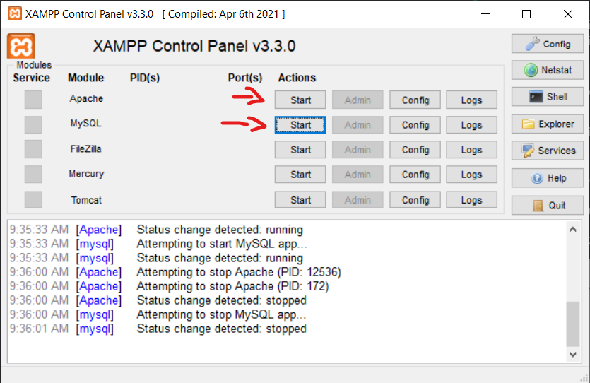
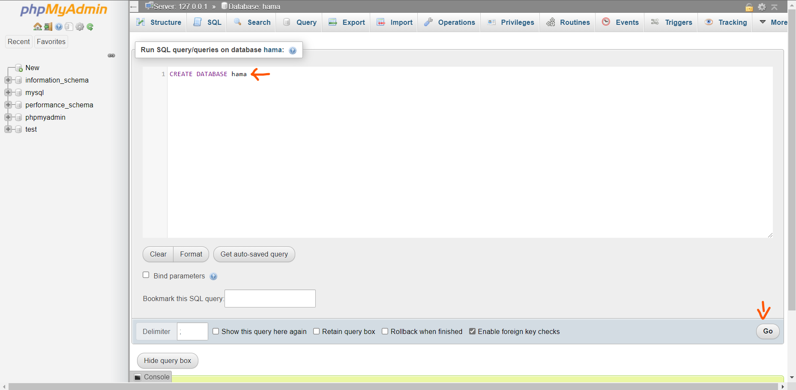
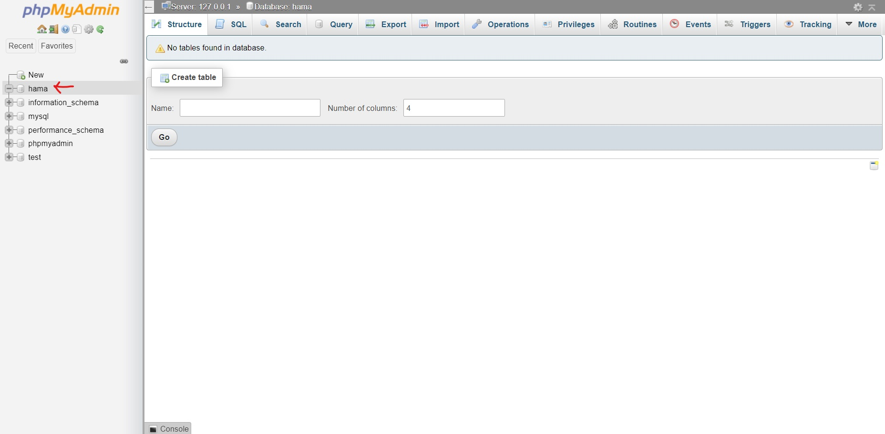
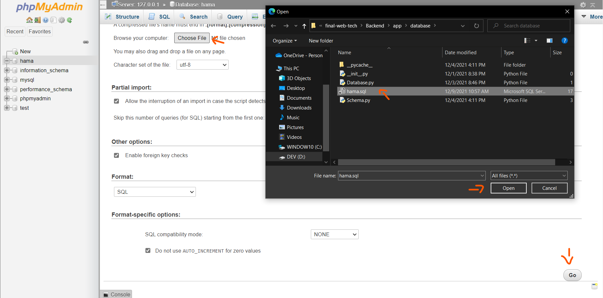
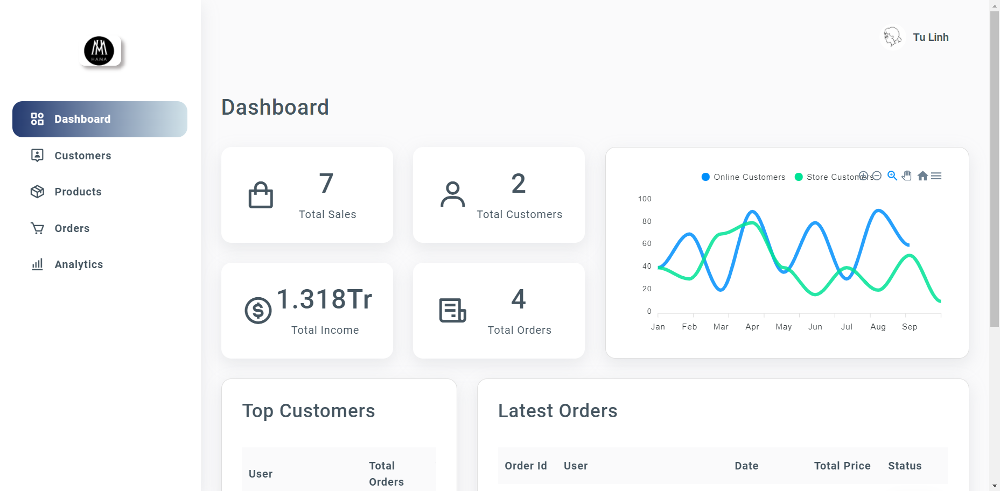
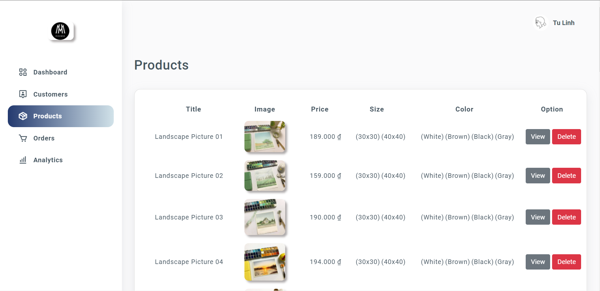
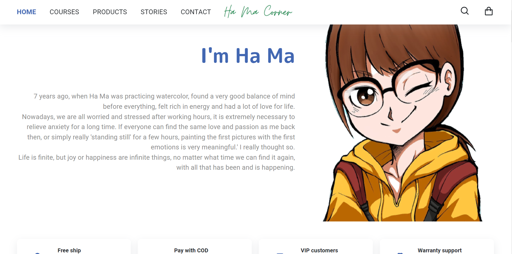
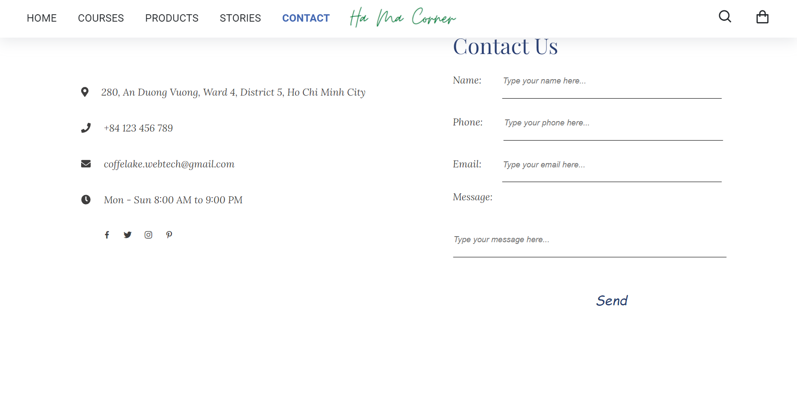
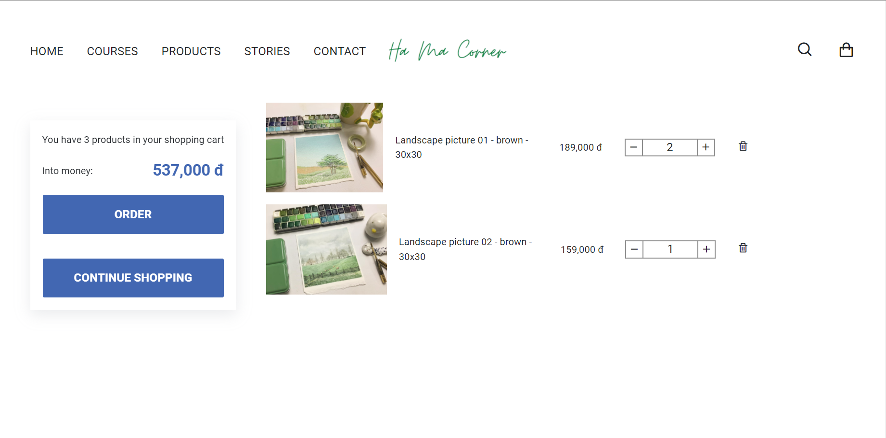
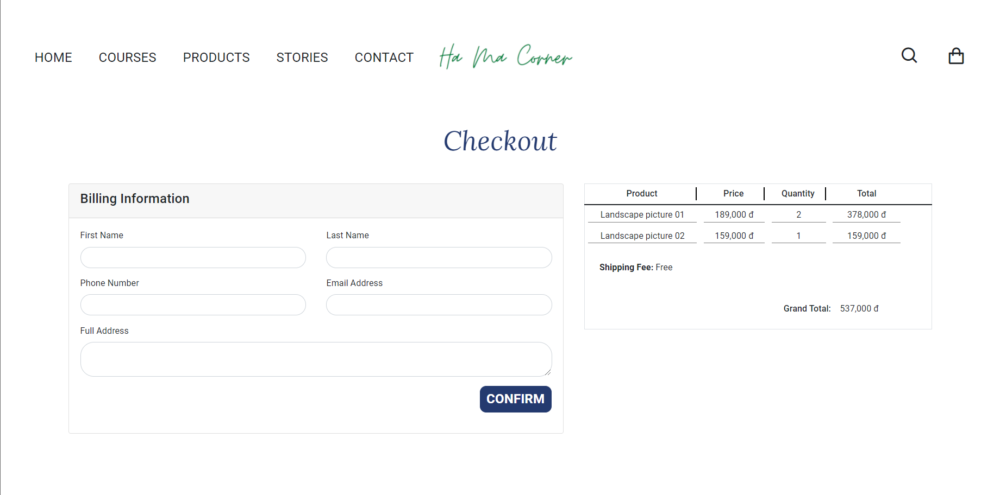

# Đồ án cuối kỳ Công nghệ web

## Design by Coffee Lake team
* ### Phạm Duy Minh - 4501104145
* ### Nguyễn Ngọc Phương Quỳnh - 4501104195
* ### Trần Thị Tứ Linh - 4501104127
* ### Huỳnh Thanh Ngân - 4501104151
* ### Sầm Thị Hoàng Trang - 4501104249

## Clone project
### 
```bash
   $ git clone https://github.com/mni-linh/final-web-tech.git
```

## Install Xampp and Python
```bash
   $ winget install -e --id ApacheFriends.Xampp.8.1
```

```bash
   $ winget install -e --id Python.Python.3.10
```
## Start Apache and MySQL

## Open phpMyAdmin


## Set up database
* ### Step 1: Create database name hama

* ### Step 2: Select database hama

* ### Step 3: Import file hama.sql from .\Backend\app\database\hama.sql


## Set up Backend
```
   $ cd Backend
   $ env\Scripts\activate
   $ pip install -r requirements.txt
```
## Start Backend
```
   $ python main.py
```
## follow link: http://localhost:8000/docs

## Set up project
```
   $ npm i
```
## Start project
```
   $ npm run start
```
## Build project
```
   $ npm run build
```
## Set up page admin
```
   $ cd admin
   $ npm i
```
## Start page admin
```
   $ npm start
```
## Demo
* ### Admin


* ### Customer






